# PII Guardrail — Implementation

Build-level detail: module graph, call paths, data structures, file lifecycle, test coverage, and
the order to build in. For *what the product does*, see [WORKFLOW.md](WORKFLOW.md). For *how to use
it*, see the [README](../README.md).

> Diagrams are Mermaid — they render on GitHub and in VS Code Markdown Preview.

---

## 1. Build sequence and decision gates

Two gates can change the design. Neither is skippable.

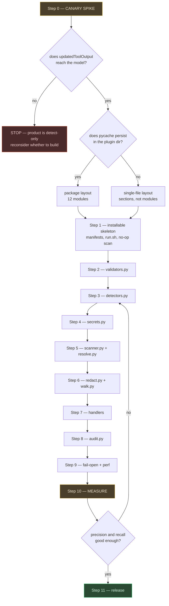

**Gate 1** decides whether the product exists. If tool-output rewriting does not work, this becomes
a detect-and-alert tool — strictly worse, and `gitleaks` already covers commit-time scanning better.

**Gate 2** decides file layout. `python3 -S -E` starts in ~8 ms; twelve modules with a warm
`__pycache__` add ~2 ms, but with a read-only plugin directory they re-compile every invocation and
add ~10–20 ms, against a 25 ms budget.

**Gate 3** is the honesty gate. No class ships enabled-by-default without measured numbers.

---

## 2. Module dependency graph

Strictly layered. Arrows point the way imports go; nothing points back up.

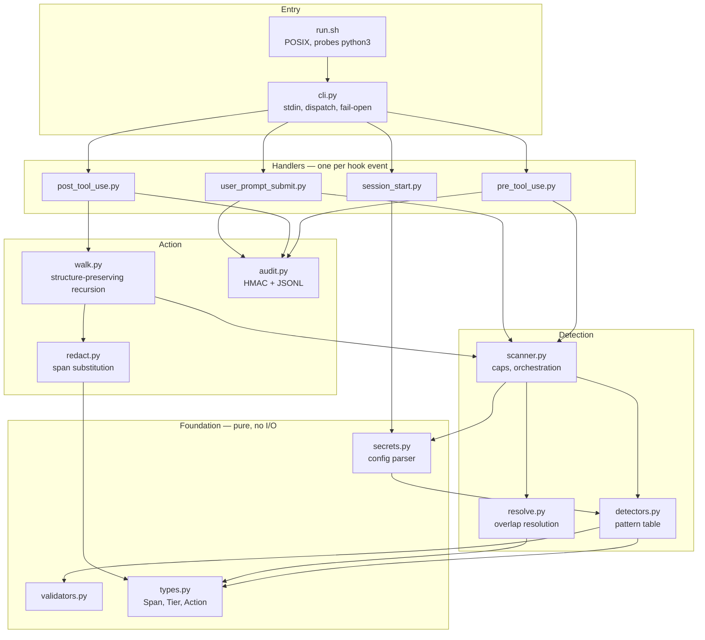

Consequences of the layering:

- **L1 has no imports and no I/O.** Exhaustively unit-testable, and the layer where correctness
  actually lives.
- **Handlers are pure functions** of their payload — the whole hook surface is testable from
  recorded JSON with no Claude Code running.
- **Only `walk.py` and `redact.py` mutate text.** Everything else observes.

---

## 3. File tree

```
PIIGuardrail/
├── .claude-plugin/
│   ├── plugin.json              manifest, userConfig schema
│   └── marketplace.json         "source": "." — self-installing
├── hooks/
│   ├── hooks.json               4 events, matchers, timeout 5
│   ├── run.sh                   python3 probe then exec
│   └── scan.py                  entry; imports the package OR is the whole thing
├── piiguard/                    (omitted if Gate 2 says single-file)
│   ├── types.py                 Span, Tier, Action, ScanResult
│   ├── validators.py            luhn, entropy, jwt, placeholder, ip, card, email
│   ├── detectors.py             declarative pattern table
│   ├── secrets.py               secrets.txt parser
│   ├── scanner.py               caps + orchestration
│   ├── resolve.py               longest-match-wins
│   ├── redact.py                span substitution, PEM handling
│   ├── walk.py                  deep structure-preserving rewrite
│   ├── audit.py                 salt lifecycle, HMAC, JSONL
│   ├── cli.py                   dispatch + fail-open wrapper
│   └── handlers/
│       ├── user_prompt_submit.py
│       ├── post_tool_use.py
│       ├── pre_tool_use.py
│       └── session_start.py
├── default-secrets.txt          seeded to CLAUDE_PLUGIN_DATA on first run
├── default-policy.json          mode + audit defaults
├── tools/
│   ├── canary.py                Step 0 probe
│   ├── corpus_check.py          precision and recall reporter
│   └── bench.py                 p95 latency assertion
├── tests/
│   ├── fixtures/                REAL payloads captured in Step 0
│   ├── corpus/                  golden files with inline EXPECT markers
│   ├── test_validators.py
│   ├── test_secrets.py
│   ├── test_scanner.py
│   ├── test_walk.py
│   ├── test_handlers.py
│   ├── test_redos.py
│   └── test_properties.py
├── docs/
│   ├── WORKFLOW.md              product architecture
│   ├── IMPLEMENTATION.md        this file
│   └── HOOK-CONTRACT.md         observed platform behaviour + version
├── README.md
└── LICENSE
```

---

## 4. Call path — prompt scan

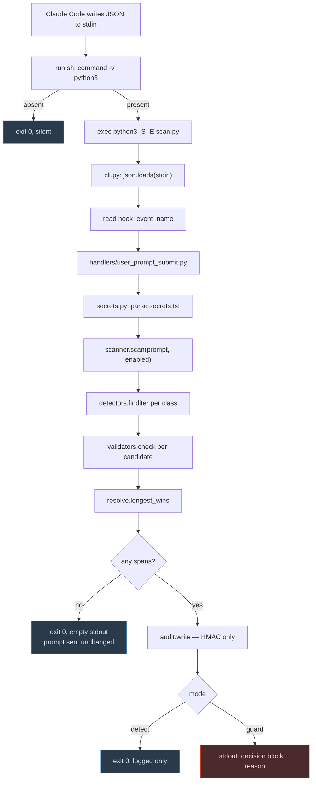

---

## 5. Call path — tool output rewrite

The only path that modifies what the model sees.

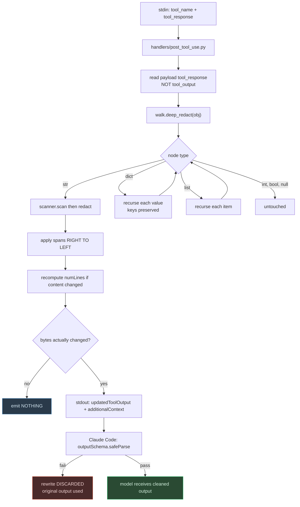

Three implementation rules this path enforces:

| Rule | Why |
|---|---|
| Read `tool_response` | `tool_output` yields `undefined` — the scanner finds nothing and every secret passes, indistinguishable from "clean" |
| Substitute right-to-left | Left-to-right shifts every later offset and corrupts the output |
| Never emit an identity rewrite | Hooks run in parallel, last write wins — an unchanged copy can clobber another plugin's real redaction |

---

## 6. Secrets file parsing

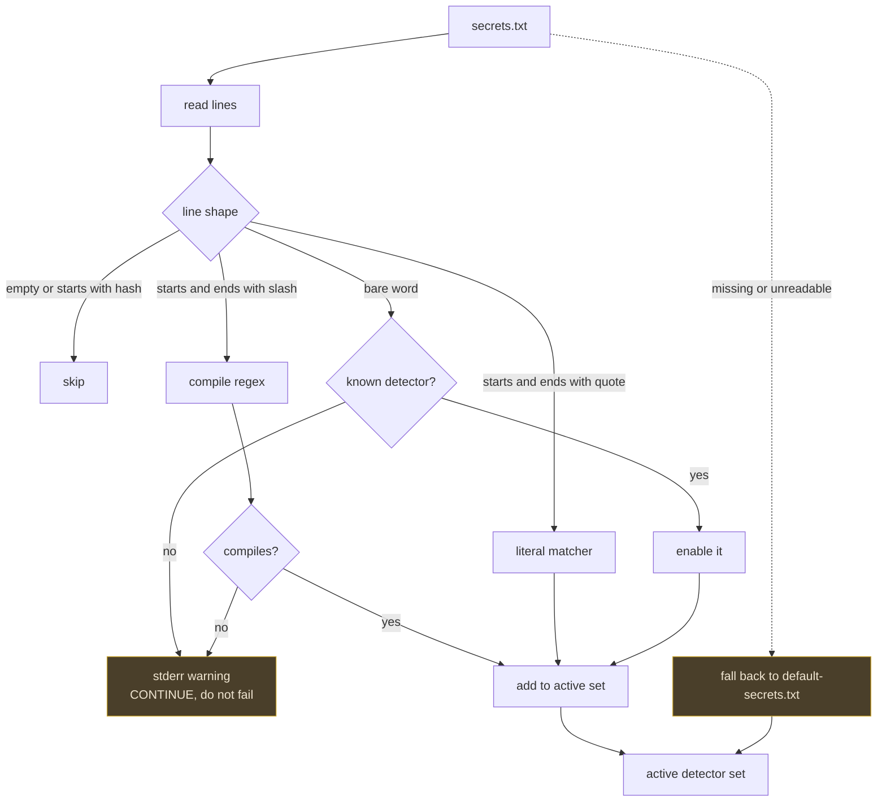

**A malformed config must never block a session.** Every failure path degrades to a warning.

---

## 7. Detector and validator matrix

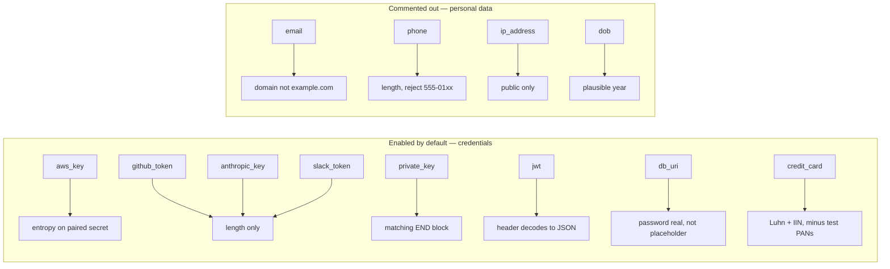

| Class | Anchored | Why anchoring matters |
|---|---|---|
| `aws_key`, `github_token`, `anthropic_key`, `slack_token`, `jwt` | ✅ | Literal prefix → linear time → safe on oversized input |
| `private_key` | ✅ | Literal `BEGIN` marker |
| `db_uri`, `credit_card`, `email`, `phone`, `ip_address`, `dob` | ❌ | Subject to size and line caps |

---

## 8. Data model

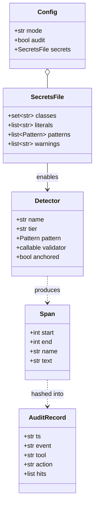

`AuditRecord.hits` holds `{class, id}` where `id = HMAC-SHA256(salt, value)[:12]`. **The value
itself is never stored** — and a plain hash is not used either, because `sha256` of a date of birth
or a card number is brute-forceable in seconds.

---

## 9. State file lifecycle

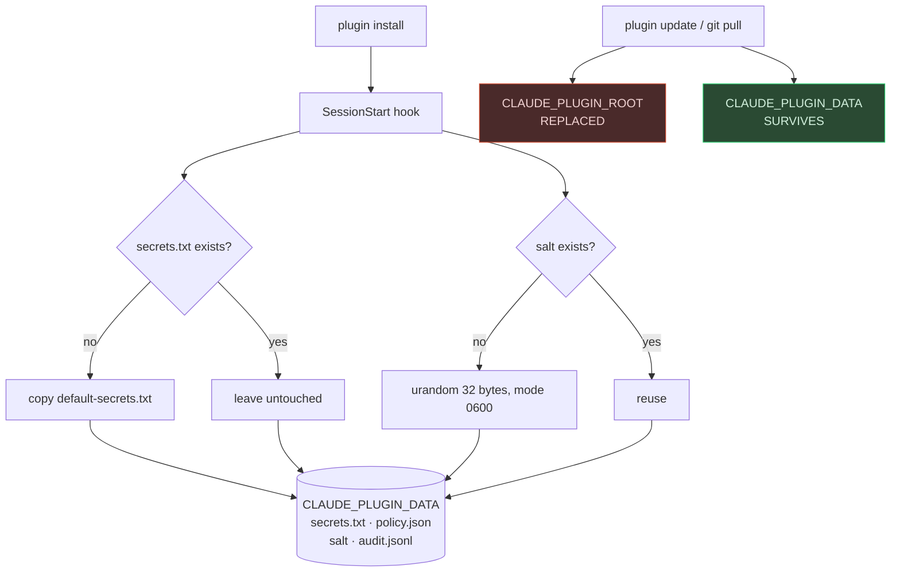

Anything user-owned lives in `CLAUDE_PLUGIN_DATA`. Writing config into the plugin root loses it on
every update.

---

## 10. Failure paths

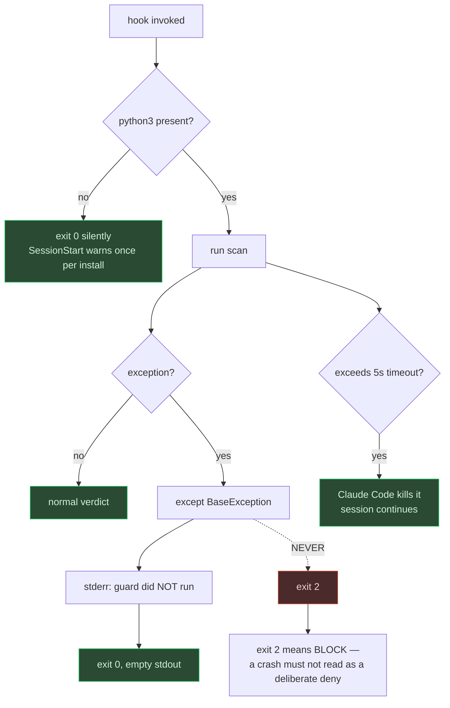

**Fail open, loudly.** A silent failure is worse than either alternative — it manufactures false
confidence in a tool people installed to stop worrying.

---

## 11. Bounded work — ReDoS defence

Python's `re` has **no timeout**. A backtracking pattern would hang for the full hook timeout.

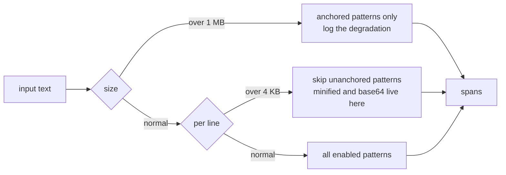

| Guard | Value | Without it |
|---|---|---|
| `hooks.json` timeout | 5 s | The 600 s default freezes a session for ten minutes with no explanation |
| Input cap | 1 MB | A 50 MB log dump scans in full |
| Line cap | 4 KB | Minified bundles trigger pathological backtracking |

---

## 12. Test coverage map

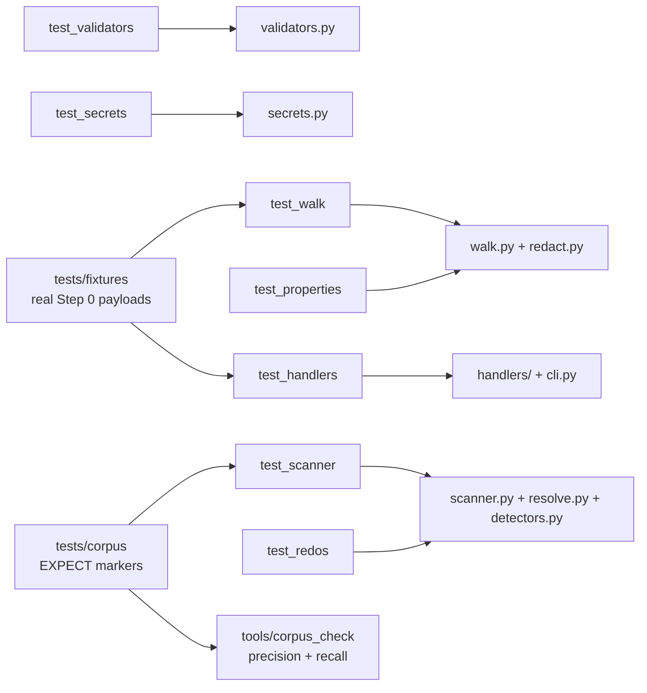

| Test | Asserts |
|---|---|
| `test_validators` | `5432` is not a card; `4242…` is excluded; `127.0.0.1` is not a hit |
| `test_secrets` | Unknown word warns; bad regex skipped; missing file falls back |
| `test_scanner` | Nested spans resolved; caps honoured |
| `test_walk` | Every key and type survives; rewrite passes schema validation |
| `test_handlers` | Fixture in → exact JSON out |
| `test_redos` | 1 MB adversarial input inside the bound |
| `test_properties` | Never crashes; never drops non-secret text |

Run with `python3 -m unittest discover tests/` — no packages to install.

---

## 13. Release checklist

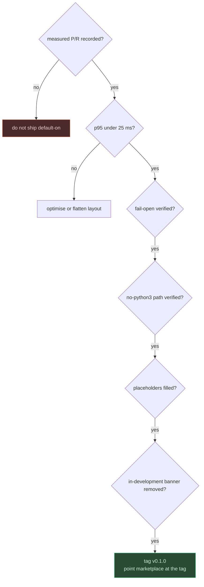

Pinning the marketplace entry at a tag rather than a branch means a push to `main` does not ship
straight to every installed user — which matters more for a security tool than for most software.
